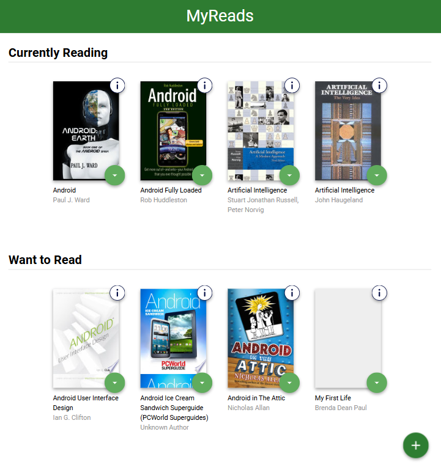

# MyReads - A React Book Tracking Application

MyReads is a personal book tracking application built with React that allows you to organize your books into different reading categories and search for new books to add to your collection.

## 🔮 Sneak Peak of the UI



## 📑 Table of Contents

- [MyReads - A React Book Tracking Application](#myreads---a-react-book-tracking-application)
  - [🔮 Sneak Peak of the UI](#-sneak-peak-of-the-ui)
  - [📑 Table of Contents](#-table-of-contents)
  - [🚀 Features](#-features)
    - [📚 Book Management](#-book-management)
    - [🔍 Book Search](#-book-search)
    - [📖 Detailed Book Information](#-detailed-book-information)
    - [🎨 Modern UI/UX](#-modern-uiux)
  - [🛠️ Technology Stack](#️-technology-stack)
    - [Frontend](#frontend)
    - [Development Tools](#development-tools)
    - [Backend API](#backend-api)
  - [📁 Project Structure](#-project-structure)
  - [🚀 Getting Started](#-getting-started)
    - [Prerequisites](#prerequisites)
    - [Installation](#installation)
  - [🎯 How to Use](#-how-to-use)
    - [📚 Managing Your Books](#-managing-your-books)
    - [📗 Adding New Books](#-adding-new-books)
    - [📖 Book Information Modal](#-book-information-modal)
  - [🔧 Configuration](#-configuration)
    - [🖥️ Development Server](#️-development-server)
    - [🏗️ Build Configuration](#️-build-configuration)
  - [🌐 API Integration](#-api-integration)
    - [🟢 Available Endpoints](#-available-endpoints)
    - [🔒 Authentication](#-authentication)
  - [📱 Responsive Design](#-responsive-design)
    - [Desktop (600px+)](#desktop-600px)
    - [Mobile (\<600px)](#mobile-600px)
  - [🔮 Future Enhancements](#-future-enhancements)
    - [Planned Features](#planned-features)
    - [Technical Improvements](#technical-improvements)
  - [🤝 Contributing](#-contributing)
  - [🔗 Credits](#-credits)

## 🚀 Features

### 📚 Book Management

- **Three Reading Categories**: Organize books into "Currently Reading", "Want to Read", and "Read"
- **Easy Book Movement**: Use dropdown menus to move books between categories
- **Real-time Updates**: Changes are instantly synchronized with the backend API

### 🔍 Book Search

- **Smart Search**: Search by title, author, or ISBN
- **Debounced Search**: Optimized search with 500ms delay to reduce API calls
- **Search Results**: View detailed search results with book covers and information
- **Status Awareness**: Search results show current shelf status for books you already own

### 📖 Detailed Book Information

- **Info Modal**: Click the info button (ℹ️) on any book to view detailed information
- **Comprehensive Details**: View author, publication date, page count, categories, ratings, publisher, and description
- **Responsive Design**: Modal adapts to different screen sizes

### 🎨 Modern UI/UX

- **Clean Interface**: Material Design-inspired layout with intuitive navigation
- **Responsive Design**: Works seamlessly on desktop and mobile devices
- **Smooth Animations**: Hover effects and transitions for better user experience
- **Accessibility**: Proper ARIA labels and keyboard navigation support

## 🛠️ Technology Stack

### Frontend

- **React 19.1.0** - Modern React with latest features
- **React Router 6.18.0** - Client-side routing for navigation
- **Vite 7.0.0** - Fast build tool and development server
- **CSS3** - Custom styling with Flexbox and Grid layouts

### Development Tools

- **ESLint** - Code linting with React-specific rules
- **React Hooks** - Modern state management with useState and useEffect
- **HashRouter** - Browser routing compatible with static hosting

### Backend API

- **Udacity Books API** - RESTful API for book data and user library management

## 📁 Project Structure

```
src/
├── components/
│   ├── App.js              # Main application component with routing
│   ├── MainBookShelf.js    # Main page with reading categories
│   ├── BookShelf.js        # Individual bookshelf component
│   ├── Book.js             # Single book component with info button
│   ├── BookModal.js        # Detailed book information modal
│   └── BookSearch.js       # Search functionality and results
├── utils/
│   └── BooksAPI.js         # API utilities for backend communication
├── icons/                  # SVG icons for UI elements
├── App.css                 # Application styles
├── index.css               # Global styles
└── main.js                 # Application entry point
playwright/
├── playwright-report/      # Failed reports for playwright end-to-end tests
├── tests/                  # End-to-end tests
├── package.json            # Playwright-specific package folder
└── playwright.config       # Playwright-specific configuration options
```

## 🚀 Getting Started

### Prerequisites

- Node.js (version 20.19.0 or higher)
- npm or yarn package manager

### Installation

1. **Clone the repository**

   ```bash
   git clone <repository-url>
   ```

2. **Install dependencies**

   ```bash
   npm install
   ```

3. **Start the development server**

   ```bash
   npm run start
   ```

4. **Open your browser**
   Navigate to `http://localhost:3001` to view the application

## 🎯 How to Use

### 📚 Managing Your Books

1. **View Your Library**: The main page displays your books in three categories
2. **Move Books**: Click the dropdown arrow on any book to change its category
3. **View Details**: Click the info button (ℹ️) to see detailed book information

### 📗 Adding New Books

1. **Access Search**: Click the "Add a book" button (+ icon) at the bottom right
2. **Search Books**: Type in the search box to find books by title, author, or ISBN
3. **Add to Library**: Use the dropdown on search results to add books to your library
4. **Return Home**: Click "Close" to return to your main library

### 📖 Book Information Modal

- **Open Modal**: Click the white info button in the top-right corner of any book
- **View Details**: See comprehensive information including description, ratings, and metadata
- **Close Modal**: Click the X button or click outside the modal to close

## 🔧 Configuration

### 🖥️ Development Server

The project is configured to run on port 3001 with the following features:

- **Hot Module Replacement**: Instant updates during development
- **Proxy Configuration**: Handles API requests and static assets
- **CORS Support**: Configured for development environment

### 🏗️ Build Configuration

- **Asset Optimization**: Automatic code splitting and minification
- **Relative Paths**: Compatible with various hosting platforms
- **Modern JavaScript**: Uses latest ES2020 features with Babel compilation

## 🌐 API Integration

The application integrates with the Udacity Books API:

### 🟢 Available Endpoints

- `GET /books` - Retrieve user's book collection
- `PUT /books/:id` - Update book shelf status
- `POST /search` - Search for books in the database

### 🔒 Authentication

- Uses localStorage token for user session management
- Automatic token generation for new users

## 📱 Responsive Design

### Desktop (600px+)

- Multi-column book grid layout
- Side-by-side modal information display
- Optimized padding and spacing

### Mobile (<600px)

- Single-column book layout
- Stacked modal information
- Touch-friendly button sizes
- Optimized search interface

## 🔮 Future Enhancements

### Planned Features

- **Dark Mode**: Toggle between light and dark themes

### Technical Improvements

- **Testing**: Add comprehensive unit and integration tests

## 🤝 Contributing

This is a learning project, but suggestions and improvements are welcome! Please feel free to submit issues or pull requests.

## 🔗 Credits

Udacity Starter Code - this project is a fork from <https://github.com/udacity/nd0191-c1-myreads>
